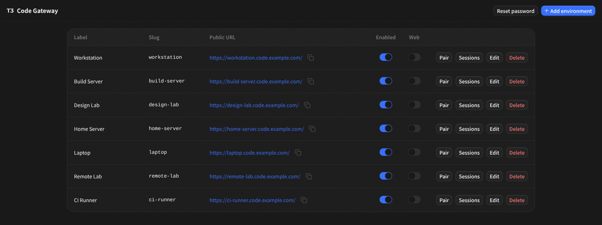
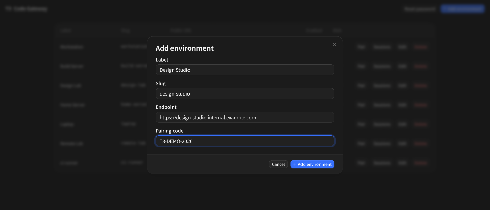
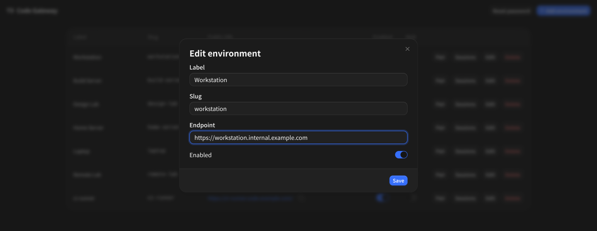
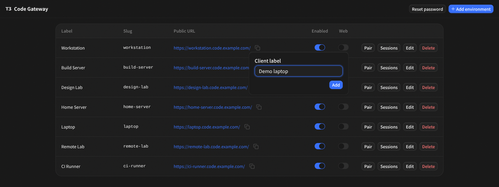
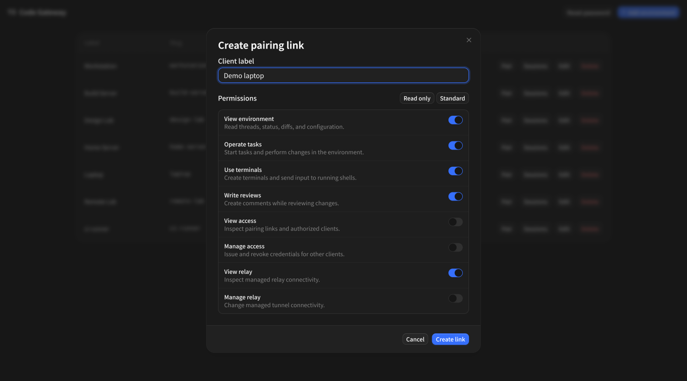
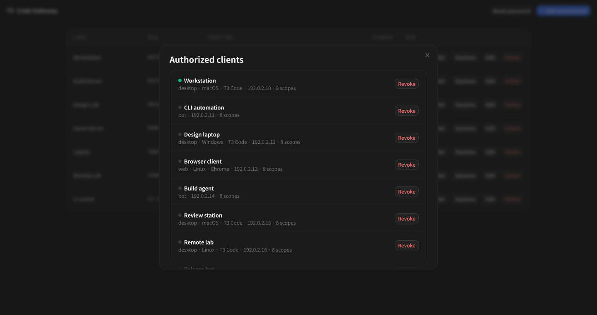

# T3 Code Gateway

T3 Code Gateway manages multiple self-hosted T3 Code environments behind one public entry point.

It gives you:

- a public T3 Code web app at `/`
- an admin app at `/admin`
- environment-specific public URLs through Traefik
- pairing links and QR codes for gateway-managed clients
- encrypted storage for environment admin tokens
- automatic browser credential sync for enabled environments

The gateway is not a hosted control plane and does not proxy normal T3 Code traffic. It manages environment metadata, credentials, and Traefik routing. Traefik sends environment traffic directly to the configured T3 Code instance.

## Screenshots

### Environment management







### T3 Code Web



### Pairing and access





## How It Works

T3 Code Gateway has three surfaces:

| Surface       | Path             | Purpose                                                                                                |
| ------------- | ---------------- | ------------------------------------------------------------------------------------------------------ |
| T3 Code web   | `/`              | Serves the packaged T3 Code web app with gateway-managed environments injected into its local catalog. |
| Gateway admin | `/admin`         | Manage environments, sessions, pairing links, password, and diagnostics.                               |
| Gateway API   | `/api/gateway/*` | Admin UI RPC, auth, catalog sync, and Traefik config inspection.                                       |

Each environment gets a public URL derived from its slug:

```text
https://<slug>.<public-base-domain>/
```

Example:

```text
https://code.example.com/            gateway web
https://code.example.com/admin       gateway admin
https://desktop.code.example.com/    desktop T3 Code environment
https://laptop.code.example.com/     laptop T3 Code environment
```

## Concepts

**Environment**

An attached T3 Code instance. It has a label, slug, internal base URL, public base URL, enabled flag, and browser token scopes.

**Slug**

The public host prefix for an environment. If the public base domain is `code.example.com`, slug `desktop` becomes `desktop.code.example.com`.

**Admin token**

A T3 Code bearer token created on the environment and stored encrypted by the gateway. The gateway uses it to create pairing links, browser credentials, and list sessions. Browser clients never receive this token.

**Browser token scopes**

The scopes used when the gateway creates normal browser/device credentials for an environment. These are configured per environment.

**Gateway device**

A browser/device identity used by the gateway catalog sync. It is not an auth credential. It lets the gateway avoid creating fresh environment tokens on every page load.

## First Login

Start the server and open:

```text
/admin/login
```

If no user exists, the server creates the first local user and logs the generated password. Sign in as `admin`, then use **Reset password** in the header.

V1 has one local gateway user. That user can administer every environment.

## Adding an Environment

Create an administrative bearer token inside the target T3 Code environment.

Then open `/admin` and add the environment with:

- label
- slug
- internal host
- pairing code
- browser token scopes

The gateway validates the environment and stores the admin token encrypted.

Once the environment is enabled:

- Traefik config includes a router for the environment public host.
- The T3 Code web app at `/` syncs the environment into its local catalog.
- The admin UI can create pairing links and list sessions for that environment.

## Pairing

From the environment table, open the pairing dialog.

The flow is:

1. Choose a client label and permissions.
2. The gateway asks the target environment to create a pairing credential.
3. The dialog shows the pairing link, pairing code, and QR code.

This mirrors the T3 Code pairing flow. The gateway only brokers the creation of the credential using the stored environment admin token.

## Client Sessions

The sessions dialog lists sessions reported by the target T3 Code environment.

Gateway-created sessions are marked by role:

- `admin`: the stored admin token or current admin session
- `device`: a browser/device credential created by gateway catalog sync

Revocation only happens when explicitly requested from the UI.

## T3 Code Web Catalog Sync

The gateway serves the packaged T3 Code web dist at `/`.

At page load, the gateway bootstrap syncs enabled environments into T3 Code's local browser catalog:

1. Browser sends the list of gateway-managed environment IDs it already has.
2. Gateway returns credentials for missing environments.
3. Gateway returns stale environment IDs that should be removed locally.
4. Browser updates the T3 Code catalog before starting the app.

The gateway does not overwrite every local credential on every load. It reconciles only missing and stale gateway-managed entries.

## Traefik Routing

Gateway writes a Traefik file-provider dynamic config.

Example generated config:

```yaml
http:
  routers:
    t3-env-desktop:
      entryPoints:
        - websecure
      rule: Host(`desktop.code.example.com`)
      service: t3-env-desktop
      tls: {}
  services:
    t3-env-desktop:
      loadBalancer:
        passHostHeader: true
        servers:
          - url: http://10.0.0.20:3773
```

There are two deployment modes:

- External Traefik: Gateway writes the dynamic file, and your separately managed Traefik includes it.
- Bundled Traefik: Gateway and Traefik run in one s6-based container.

## Images

External Traefik mode:

```text
ghcr.io/tarik02/t3code-gateway:<version>
```

Bundled Traefik mode:

```text
ghcr.io/tarik02/t3code-gateway/bundled-traefik:<version>
```

Release tags are versions:

```text
ghcr.io/tarik02/t3code-gateway:0.1.0
ghcr.io/tarik02/t3code-gateway/bundled-traefik:0.1.0
```

Every `master` push also publishes test images tagged with the full commit SHA:

```text
ghcr.io/tarik02/t3code-gateway:sha-<full-commit-sha>
ghcr.io/tarik02/t3code-gateway/bundled-traefik:sha-<full-commit-sha>
```

## External Traefik Usage

Use this image when Traefik is deployed separately:

```text
ghcr.io/tarik02/t3code-gateway:<version>
```

Mount persistent data at `/data`. Configure your Traefik static config to include:

```yaml
providers:
  file:
    filename: "/data/traefik/environments.yml"
    watch: true
```

Run the gateway with the same `/data/traefik/environments.yml` mounted so it can write environment routers:

```sh
docker run \
  --name t3code-gateway \
  --restart unless-stopped \
  -p 8787:8787 \
  -v t3code-gateway-data:/data \
  -e T3_GATEWAY_PUBLIC_BASE_DOMAIN=code.example.com \
  ghcr.io/tarik02/t3code-gateway:<version>
```

Put your existing reverse proxy in front of the gateway host and route:

```text
https://code.example.com/      -> gateway port 8787
https://code.example.com/admin -> gateway port 8787
```

Environment hosts are routed by Traefik from the generated dynamic config:

```text
https://desktop.code.example.com -> configured desktop environment
```

## Bundled Traefik Usage

Use this image when Gateway should run Traefik in the same container:

```text
ghcr.io/tarik02/t3code-gateway/bundled-traefik:<version>
```

Run it with ports `80`, `443`, and optionally `8787` exposed:

```sh
docker run \
  --name t3code-gateway \
  --restart unless-stopped \
  -p 80:80 \
  -p 443:443 \
  -p 8787:8787 \
  -v t3code-gateway-data:/data \
  -e T3_GATEWAY_PUBLIC_BASE_DOMAIN=code.example.com \
  ghcr.io/tarik02/t3code-gateway/bundled-traefik:<version>
```

The bundled Traefik config reads dynamic routers from:

```text
/data/traefik/environments.yml
```

## Configuration

| Variable                              | Default                                  | Description                                                     |
| ------------------------------------- | ---------------------------------------- | --------------------------------------------------------------- |
| `T3_GATEWAY_DATABASE_PATH`            | `/var/lib/t3code-gateway/gateway.sqlite` | SQLite database path.                                           |
| `T3_GATEWAY_LISTEN_HOST`              | `0.0.0.0`                                | Server bind host.                                               |
| `T3_GATEWAY_LISTEN_PORT`              | `8787`                                   | Server bind port.                                               |
| `T3_GATEWAY_PUBLIC_BASE_DOMAIN`       | `localhost`                              | Base domain for generated environment public URLs.              |
| `T3_GATEWAY_SECRET_KEY_FILE`          | required                                 | 32-byte encryption key file for stored tokens.                  |
| `T3_GATEWAY_TRAEFIK_DYNAMIC_FILE`     | unset                                    | Path for generated Traefik dynamic config.                      |
| `T3_GATEWAY_TRAEFIK_ENTRYPOINT`       | `websecure`                              | Comma-separated entrypoints for generated routers.              |
| `T3_GATEWAY_TRAEFIK_TLS_ENABLED`      | `true`                                   | Whether generated routers include TLS config.                   |
| `T3_GATEWAY_TRAEFIK_CERT_RESOLVER`    | empty                                    | Optional Traefik cert resolver.                                 |
| `T3_GATEWAY_TRAEFIK_AUTH_MIDDLEWARES` | empty                                    | Comma-separated middleware names attached to generated routers. |
| `T3_GATEWAY_ADMIN_STATIC_ROOT`        | unset                                    | Built admin UI root.                                            |
| `T3_GATEWAY_T3CODE_WEB_STATIC_ROOT`   | unset                                    | Built T3 Code web dist served at `/`.                           |
| `T3_GATEWAY_T3CODE_WEB_BUILD_ID`      | unset                                    | Optional build id exposed to browser catalog sync.              |

## License

MIT
